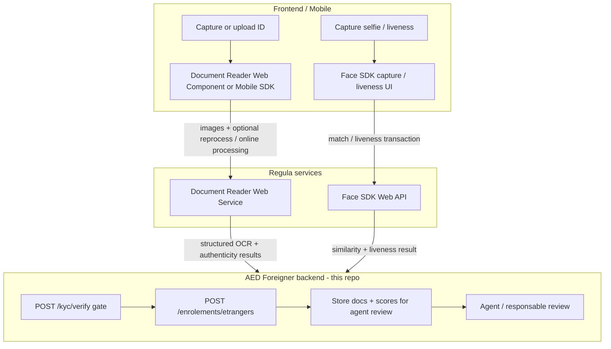

# Regula: backend role & track assessment

**Date:** 2026-08-04  
**Sources:**
- [Regula developer docs](https://docs.regulaforensics.com/)
- [Document Reader SDK architecture](https://docs.regulaforensics.com/develop/doc-reader-sdk/overview/architecture/)
- [Face SDK Web OpenAPI](https://dev.regulaforensics.com/FaceSDK-web-openapi/)
- Local code: `app/Services/Regula/*`, `KycVerificationService`, `guidelines.md` §13.1
- Deploy: `docker/regula/` (Document Reader + Face full stack)

---

## 1. What Regula actually is (two products)

| Product | Purpose | Typical clients |
|---------|---------|-----------------|
| **Document Reader SDK** | ID verification: capture/crop document, MRZ/barcode/VIZ OCR, authenticity checks, optional RFID/mDL | Mobile SDK, Web Components, **Web Service** (server) |
| **Face SDK** | Biometric verification: face detect/quality, **1:1 match**, 1:N search, **liveness** | Mobile/Web capture + **Face Web API** (`/api/match`, liveness, person/group) |

They can be integrated together: after Document Reader finishes, Face SDK can match the portrait from the document (VIZ/RFID) against a live selfie / liveness capture.

Licensing: Document Reader and Face each need a valid license (trial **OL115321** covers on-prem Web Services via `regula.license`).

---

## 2. What role does *our* backend play?

In Regula’s recommended architectures, work is split like this:

### Backend responsibilities (what we own)

1. **Orchestration / gate** — Do not let submit proceed until ID + biometry checks pass (or explicitly fail-closed).
2. **Call Regula Web APIs** (or receive client transaction IDs and **re-verify server-side**) with images or `livenessTransactionId`.
3. **Persist results** — face match score, liveness outcome, raw analysis payload for agents and audit.
4. **Trust boundary** — Prefer Complete Server-Side Verification / never trust a client-only “liveness: OK” string without a server check.
5. **Store documents** for human review (MinIO/S3 after submit).
6. **Surface analysis** on agent/responsable detail (`analyse_kyc`).

### What the backend does *not* need to own

- Camera UX, document framing, guided multipage capture → **frontend** (Web Components / Mobile SDK).
- On-device WASM/Core document DB → client SDK (unless using Online Processing).
- Running Regula Core inside Laravel — we talk HTTP to Document Reader / Face **Web Services**.
- Post-enrollment auth OTP / Mobile ID MFA → **TrustedX** (see `guidelines.md` §13.3 / §5 product auth). Finalisation PK+OTP is an AED gate unrelated to Regula.

### Face / Document endpoints we use

| Product | Endpoint | Role |
|---------|----------|------|
| Document Reader | `POST /api/process` | ID process (scenario e.g. `FullProcess`) |
| Document Reader | `GET /api/healthz` | Health |
| Face | `POST /api/match` | 1:1 selfie vs document portrait / recto |
| Face | `GET /api/v2/liveness?transactionId=` | Optional liveness transaction status |
| Face | `GET /api/healthz` | Health |

Person / group / 1:N search: **not** KYC v1.

---

## 3. What this backend does today

| Piece | Current behavior |
|-------|------------------|
| Entry | `POST /api/v1/kyc/verify` after both OTPs |
| Clients | `DocumentReaderClient` + `FaceApiClient`; `HttpRegulaService` orchestrates them |
| Config | `REGULA_DOCUMENT_URL`, `REGULA_FACE_URL`, `REGULA_MATCH_THRESHOLD`, `REGULA_MOCK` (legacy `REGULA_URL` fallback) |
| Mock | `REGULA_MOCK=true` → `MockRegulaService` (always OK) |
| Gate | When not mocking: **selfie + recto required**; optional `liveness` / `liveness_transaction_id`; client `similarity` ignored for OK/KO |
| Scores | Similarity / risk from Face `/api/match` (+ optional liveness lookup); cached ~30 min then consumed at submit |
| After submit | `UploadEnrollmentFilesJob` → **`RegulaAnalysisJob`** → confirmation email |
| Agent UI | Detail exposes `analyse_kyc` (`liveness`, `similarity`, `risk_score`, `details`) |

On-prem / HTTPS (example): Document `https://local-doc-regula.qcdigitalhub.com`, Face `https://local-face-regula.qcdigitalhub.com` (compose in `docker/regula/`; host ports 8080/41101 bound to localhost behind reverse proxy).

---

## 4. Are we on track?

### Done vs Regula Option A

- Sync **KYC gate before submit** (OTP → KYC → enroll).
- Real Document Reader + Face HTTP clients (no fake `/api/v1/identity/analyze`).
- Fail-closed when URLs missing / HTTP fails.
- Mock/real toggle for local/CI.
- Post-submit Regula re-analysis job + agent-visible scores.
- Selfie + recto required when not mocking.

### Remaining gaps (optional / later)

| Gap | Notes |
|-----|--------|
| OCR → auto-fill `kyc_data` | Document Reader text fields not yet mapped into enrollment form fields |
| Face 1:N / person search | Out of KYC v1 scope |
| Stronger overallStatus / authenticity gating | Document summary is best-effort; tune thresholds with product |

**Verdict:** On track for **real Regula Document Reader + Face** as the KYC gate and post-submit analysis. Enrollment product flow after KYC (tracking `PK…`, agent/responsable, finalisation) is documented in `guidelines.md` §13 — not Regula-specific.

---

## 5. Target flow (as implemented)

1. **Frontend** captures ID + selfie/liveness (SDK UI against Regula HTTPS hosts as needed).
2. Frontend sends images (+ optional liveness transaction id) to **AED** `POST /kyc/verify`.
3. **AED**: Document Reader `process` → Face `match` (portrait crop when available, else recto) → optional liveness get → OK/KO + cache.
4. Submit: persist docs; chain upload → `RegulaAnalysisJob` → email; return `numero_suivi`.
5. Agents see `analyse_kyc` + documents; human decision remains authoritative.

---

## 6. References

- Document Reader architecture: https://docs.regulaforensics.com/develop/doc-reader-sdk/overview/architecture/
- Document Reader process API: https://docs.regulaforensics.com/develop/doc-reader-sdk/web-service/development/usage/process/
- Document Reader OpenAPI: https://dev.regulaforensics.com/DocumentReader-web-openapi/
- Face SDK Web OpenAPI: https://dev.regulaforensics.com/FaceSDK-web-openapi/
- Local rules: `guidelines.md` §13.1
- Compose / VPS: `docker/regula/README.md`

---

## 7. Decision log

**Chosen architecture:** Option **A** — frontend captures; AED backend calls Document Reader + Face Web APIs directly.

| Product | Demo (docs) | On-prem / AED env |
|---------|-------------|-------------------|
| Document Reader | `https://api.regulaforensics.com` | `REGULA_DOCUMENT_URL` (e.g. HTTPS reverse proxy → `:8080`) |
| Face SDK | `https://faceapi.regulaforensics.com` | `REGULA_FACE_URL` (e.g. HTTPS reverse proxy → `:41101`) |

Trial **OL115321** via Download license on Docker (`regula.license`). Prefer on-prem quota over public demo hosts for sustained testing.

**Implementation status:**

1. Config `REGULA_DOCUMENT_URL` / `REGULA_FACE_URL` + mock — **Done**
2. `DocumentReaderClient` + `FaceApiClient` + `HttpRegulaService` orchestrator — **Done**
3. Require selfie + recto when not mocking; derive scores from Face (optional liveness transaction) — **Done**
4. Dispatch `RegulaAnalysisJob`; show analysis on agent detail — **Done**
5. Optional later: person/group/search clients
